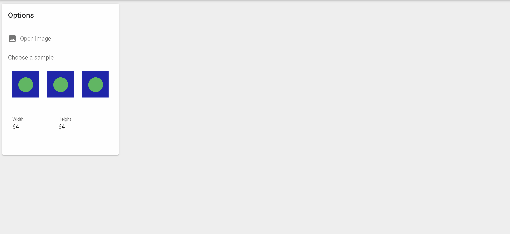

# brick-a-pic
[](https://travis-ci.com/brick-a-pic/brick-a-pic)
[](https://gitter.im/brick-a-pic-talk/community?utm_source=badge&utm_medium=badge&utm_campaign=pr-badge)
[](https://www.gnu.org/licenses/gpl-3.0)



# About
Welcome to the Brick-a-Pic Project! This is a web application that aims to make it easy for anyone to create mosaics made out of LEGO bricks. If you'd just like to get started using it, the most up-to-date version of the application is hosted on GitHub Pages, [right here](https://brick-a-pic.github.io/brick-a-pic). If you'd like to run or hack on this application yourself, a few basic setup instructions are [below](#setup-development-instructions). If you'd like to contribute, great! You can start by reading our [CONTRIBUTING.md, right here](CONTRIBUTING.md).


# Setup / Development Instructions
## Project setup
```
npm install
```

### Compiles and hot-reloads for development
```
npm run serve
```

### Compiles and minifies for production
```
npm run build
```

### Run unit tests, stored in tests/unit
```
npm run test:unit
```

### Lints and fixes files
```
npm run lint
```


# Deployment instructions using Docker
### Build a docker image from the Dockerfile
```
docker build -t image_name .
```

### Create a container from the image
```
docker run -p 8080:80 --rm --name container_name image_name